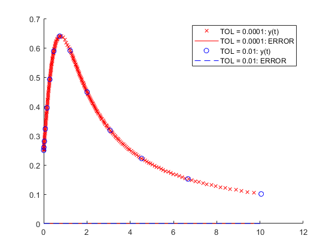
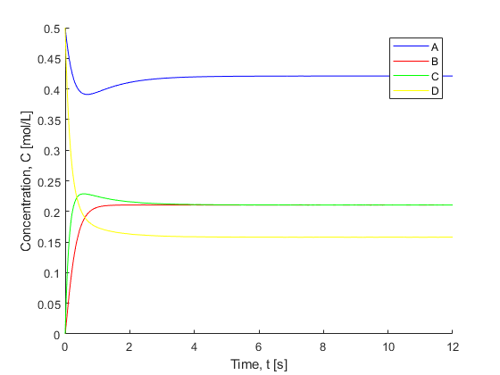
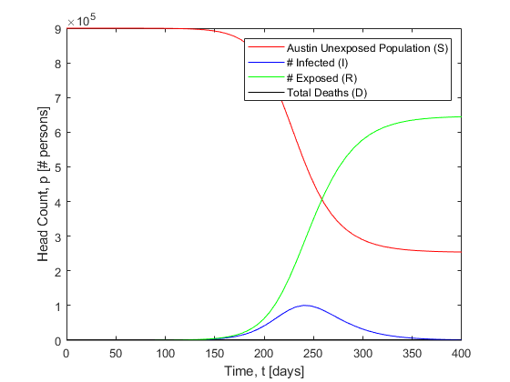

# InitialValueProblemsODE
## ChE-348 Sp21 Prof. Lynd CE5
### Q1. Use adaptive-step Runge-Kutta to solve the differential equation with high accuracy.
When the target error is set to 0.01, the result is an absolute error of 0.0. This result doesn't change
when the target error is changed to 0.0001, as the RK5 fits so cleanly.
#### Graph comparing the two target errors ("TOLs"):

#### Code snippet:
```matlab
clear all
clf
% dydt = @(t,y)(1-2*t*y)/(1+t^2); 
% RK4 and RK5 are embedded RK estimators of the y(t) function.
hold on
[tseries, yseries, abs_err] = adaptiveStep(@RK4,@RK5,.0001,.25,0,0,10); % Lower tolerance -> frequent steps
plot(tseries, yseries,'xr');
plot(tseries, abs_err,'-r');
[tseries, yseries, abs_err] = adaptiveStep(@RK4,@RK5,.01,.25,0,0,10); % Higher tolerance -> fewer steps
plot(tseries, yseries,'ob');
plot(tseries, abs_err,'--b');
legend('TOL = 0.0001: y(t)','TOL = 0.0001: ERROR','TOL = 0.01: y(t)','TOL = 0.01: ERROR');

% This version of the IVP solution function differs from the demonstration.
% It allows for the initial condition to be anywhere along the function,
% not exclusively isolated at the start of the range of t.

function [t, y, true_errors] = adaptiveStep(func1,func2,TOL,y0,t0,t_start,t_end) 
h = TOL; t(1) = t_start; % y4(1) = y0; y5(1) = y0; y(1) = y0; t(1) = t0; % These declarations rely on t0 <= t_start.
initialValue = 0;
if t_start >= t0
    y4(1) = y0; y5(1) = y0; y(1) = y0; t(1) = t0;
    initialValue = 1;
end
i = 1; % We cannot use t as the index variable because it is not an integer.
while t(i) < t_end - h % Term "-h" prevents loop from exceeding desired t range.
    if initialValue == 0 && t(i) >= t0
        y4(i) = y0; y5(i) = y0; y(i) = y0; t(i) = t0;
        initialValue = 1; % Initial condition has been applied.
                          % CAVEAT: Step size computation is ignored and
                          % restarted from this new interrupting point.
    end
    y4(i+1) = func1(y(i),t(i),h); y5(i+1) = func2(y(i),t(i),h);
    err = y5(i) - y4(i);
    if err ~= 0 % Counteract error case that RK4 == RK5.
        h = h*abs(TOL/err)^.2;
    end
    t(i+1) = t(i) + h;
    y(i+1) = func2(y(i),t(i),h);
    yAnalytical(i+1) = (0.25 + t(i+1))/(1 + t(i+1)^2);
    % calculate the true error
    true_errors(i+1) = abs(y(i+1)-yAnalytical(i+1));
    i=i+1;
end
end
```
### Q2. Do the errors, comparatively speaking, make sense?
Yes, they make sense, even though they are equivalent. The Runge-Kutta technique with adaptive step sizes 
so accurately provides an estimate of the analytical answer that the errors are negligible for both.
Of course, when the target error is reduced, the resulting absolute errors will also be reduced due to the curvature
of the function being better tapered to smaller step sizes to produce "tighter" secant lines. The Runge-Kutta technique
of computing a weighted average secant line as an approximate form of the tangent instantaneous to y at n+1 is so 
spot-on already that the difference in absolute error is relatively miniscule to the starting precision of selecting this
technique.

### Q3. Write the program describing the homogeneous reaction system.
#### Graph of species reacting in the batch reactor:


#### Code snippet:
```matlab
% Professor Lynd, from Lecture 5 (IVPs 2021), Slide 34
% Example of Homogeneous Reactor Problem
clear all
% When given a set of reactions occurring in a batch reactor...
% 1. Write CONCENTRATION OVER TIME BALANCE for each species in the reactor.
% 2. Set the conditions-- incl initial conc each species, forward and back- 
%    ward rate of each rxn.

% In the script...
% 1. Write a function emulating the interrelatedness of the dC(spec)/dt
%    balances as a function of CONCENTRATION and TIME given the initial
%    conditions (can set these as global 'assumptions').
% 2. Use a solver method, such as "ode45," to convert the system of
%    differential equations to a system of algebraic equations, and plot them.

% 2. ... plot integrated (solved) system behavior given conditions.
global k1 kb1 k2 kb2 k3 kb3 % MUST! MUST!! Declare GLOBAL in *BOTH* local contexts.
k1 = 1; kb1 = 2; k2 = 2; kb2 = 2; k3 = 3; kb3 = 4;
A = 1; B = 2; C = 3; D = 4; % Enumeration.
c0(A) = .5; c0(D) = .5; c0(B) = 0.; c0(C) = 0.;
tspan = [0 12];
[t,c] = ode45(@reaction,tspan,c0);
t(:)
c(:,A)
% Plot the action.
clf
hold on
plot(t(:),c(:,A),'-b',t(:),c(:,B),'-r',t(:),c(:,C),'-g',t(:),c(:,D),'-y');
legend('A','B','C','D')
xlabel('Time, t [s]'); ylabel('Concentration, C [mol/L]')

% 1. ... write function representing system of differential equations.
function dcdt = reaction(t,c)
global k1 kb1 k2 kb2 k3 kb3
A = 1; B = 2; C = 3; D = 4; % Enumeration of index variable. Makes life easier.
dcdt(A) = -k1*c(A)+kb1*c(B);
dcdt(B) = k1*c(A)-kb1*c(B)+kb2*c(C)-k2*c(B);
dcdt(C) = k2*c(B)+kb3*c(D)-kb2*c(C)-k3*c(C);
dcdt(D) = k3*c(C)-kb3*c(D);
dcdt = dcdt'; % Transpose default row vector to column vector for later use.
end
```

### Q4. Generate a graph describing population change over time during an epidemic.
SIRD model was applied. Simulates a reaction system, but with population change over 
time rinstead of concentration change over time.

#### Graph describing epidemic survival and infection rates:


#### Code snippet:
```matlab
% "S-I-R-D" Viral Epidemic Model (using ODE system)

% Objective:
% Simulate a viral epidemic with a POPULATION BALANCE of...
% S- Susceptible persons,     I- Infected persons,
% R- Recovered persons,       D- Dead persons.
% Given dpdt(S), dpdt(S), dpdt(S), dpdt(S) differential population balances
% and kI, kR, kD rate constants, plot the progression of the epidemic.
clear all
clf

% Define initial and system conditions:
global kI kR kD % Infection, recovery, and death rates
% system properties ("reaction rate constants"):
kI = 1.4e-7;  % infected  /person/day of total population --> the # infected.
kR = 7.14e-2; % recovered /day        out of the # infected.
kD = 1.0e-5;  % dead      /day        out of the # infected.
% initial values:
S = 1; I = 2; R = 3; D = 4;                      % Austin had 900,000 people.
p0(S) = 900000; p0(I) = 1; p0(R) = 0; p0(D) = 0; % *Enter* Patient ZERO.

% Run integration algorithm (RK4/RK5 via "ODE45" built-in solver):
[t,p]=ode45(@sirdModel,[0 400],p0)

% Plot the implications of the differential system relationship:
plot(t,p(:,S),'-r',t,p(:,I),'-b',t,p(:,R),'-g',t,p(:,D),'-k');
legend('Austin Unexposed Population (S)','# Infected (I)','# Survived (R)','Total Deaths (D)');
xlabel('Time, t [days]'); ylabel('Head Count, p [# persons]');

% Write the SIRD population balance model:
function dpdt = sirdModel(t,p)
global kI kR kD
S = 1; I = 2; R = 3; D = 4;
dpdt(S) = -kI*p(S)*p(I);
dpdt(I) = kI*p(S)*p(I)-kR*p(I)-kD*p(I);
dpdt(R) = kR*p(I);
dpdt(D) = kD*p(I);
dpdt = dpdt';
end
```
